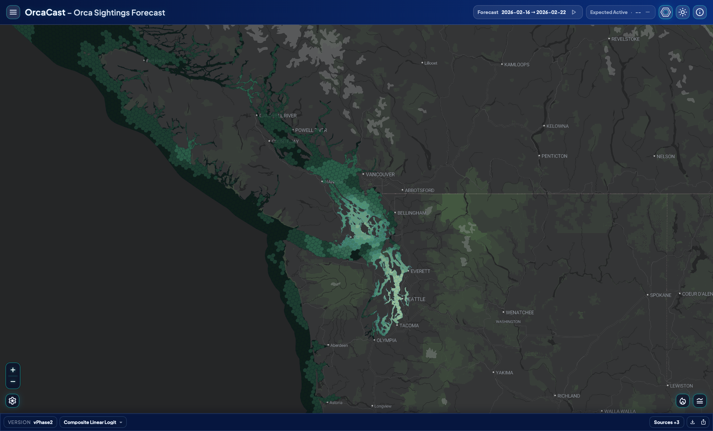
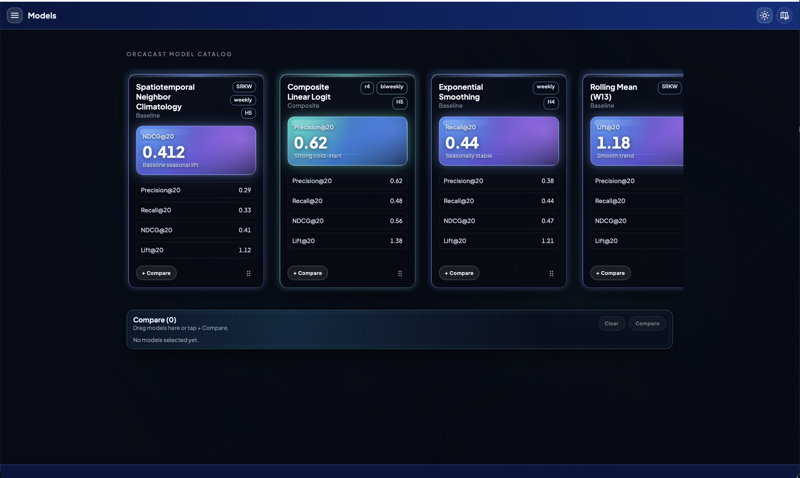
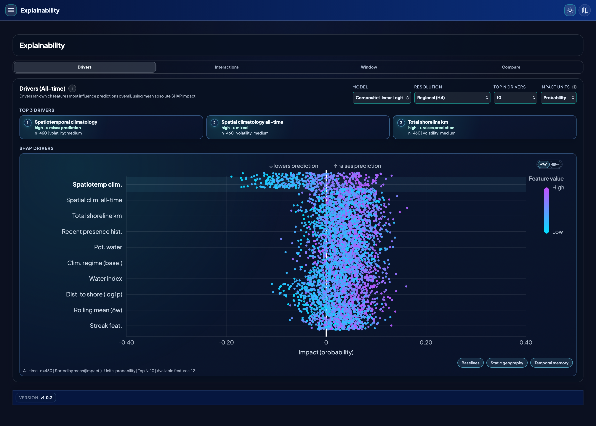
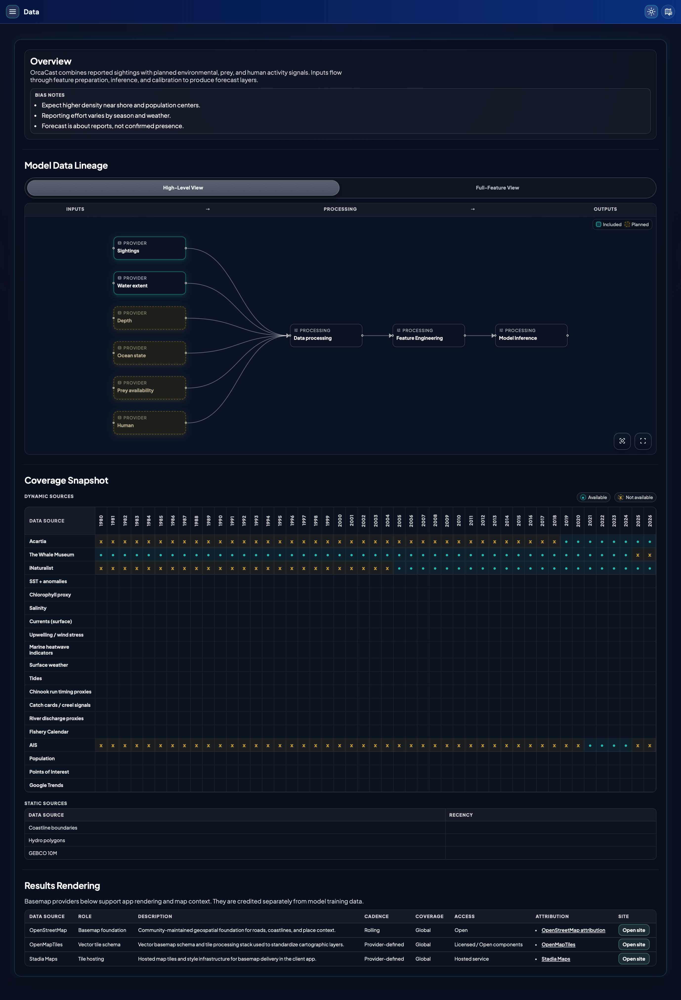

# OrcaCast App

OrcaCast is a static React + TypeScript application for exploring **weekly, H3-indexed, relative likelihood surfaces** for reported orca sightings in the Pacific Northwest. It is designed for transparent spatial analysis workflows where temporal integrity, data provenance, and reproducibility are first-class concerns.

**Live app:** [orcacast-app.pages.dev](https://orcacast-app.pages.dev)

**Important interpretation note**  
OrcaCast forecasts where sightings are *more likely to be reported relative to other cells in the same week*. It is **not** real-time whale tracking, presence/absence ground truth, or navigational guidance. 

---

## Quick Start

### Frontend

```bash
npm install
npm run dev
```

### Python utilities

```bash
python3 -m venv .venv
source .venv/bin/activate
python -m pip install -e .
python -m src.cli --help
```

---

## Table of Contents

- [1. Product Overview](#1-product-overview)
- [2. Key Capabilities](#2-key-capabilities)
- [3. Application Pages + Screenshot Gallery](#3-application-pages--screenshot-gallery)
- [4. Architecture at a Glance](#4-architecture-at-a-glance)
- [5. Data Contracts and Folder Layout](#5-data-contracts-and-folder-layout)
- [6. Forecast Payload Formats](#6-forecast-payload-formats)
- [7. Temporal / Spatial / Evaluation Integrity](#7-temporal--spatial--evaluation-integrity)
- [8. Local Development](#8-local-development)
- [9. Configuration Reference](#9-configuration-reference)
- [10. Testing and Validation Checklist](#10-testing-and-validation-checklist)
- [11. Deployment](#11-deployment)
- [12. Troubleshooting](#12-troubleshooting)
- [13. Project Structure](#13-project-structure)
- [14. Contributing Guidance](#14-contributing-guidance)
- [15. License / Credits](#15-license--credits)

---

## 1. Product Overview

This application combines:

- H3 forecast layers at multiple resolutions (`H4`, `H5`, `H6`)
- Model Compare (single swipe and dual-map comparison)
- User controls for map theme, layer mode, and view preferences
- Supporting pages for About, Data provenance, Model catalog, and Model Explainability

The app is fully static and client-rendered; no backend runtime is required to serve the core experience. This is to reduce operational costs at the drawback of slower load times on client side.

---

## 2. Key Capabilities

### Forecast and map exploration

- Browse weekly forecast periods loaded from `public/data/periods.json`
- Switch grid resolution (`H4`, `H5`, `H6`) to trade detail for regional context
- Toggle observed/forecast displays and optional map overlays
- Open tool drawers and modals for additional exploration workflows

### Comparative analysis workflows

- Compare outputs across models, periods, and resolutions
- Use swipe or dual-map interactions for side-by-side interpretation
- Inspect relative differences without changing source datasets
- Compare actuals to model outputs

### Context Pages

- **About**: interpretation guidance, caveats, and responsible use
- **Data**: lineage diagrams, dynamic/static coverage views, and provider context
- **Models**: model catalog cards and performance metrics (currently in progress state)
- **Explainability**: model diagnostics area (currently in progress state)

---

## 3. Application Pages + Screenshot Gallery

OrcaCast routes are configured in `src/App.tsx`:

- `/` → Map
- `/about` → About
- `/models` → Models
- `/explainability` → Explainability
- `/data` → Data

### Map (`/`)

Interactive forecast map with resolution controls, model/period selection, and compare workflows.



### About (`/about`)

Interpretation guidance, grid-size explanations, limitations, and responsible-use messaging.


### Models (`/models`) [Coming Soon]

Model catalog interface with card/carousel presentation and model metadata.



### Insights (`/explainability`) [Coming Soon]

Model diagnostics section scaffold



### Data (`/data`)

Data lineage, coverage matrix, source acknowledgements, and rendering/provider context.



## 4. Architecture at a Glance

### Core runtime flow

1. App bootstraps providers and routes in `src/App.tsx`
2. `MapPage` orchestrates state, data loading, compare logic, and modal workflows
3. `ForecastMap` owns rendering lifecycle (MapLibre + deck.gl)
4. Data loaders in `src/data` fetch grids, forecast payloads, periods, and related inputs
5. UI state is shared via `MapStateContext` and `MenuContext`

### Main technologies

- React 18 + TypeScript
- Vite (`rolldown-vite`)
- MapLibre GL
- deck.gl
- React Router
- Driver.js (guided tour)

---

## 5. Data Contracts and Folder Layout

All runtime data is expected under `public/data`.

### Required input files

- `public/data/periods.json`  
  Array of forecast periods:
  ```json
  [{ "year": 2025, "stat_week": 34, "label": "optional" }]
  ```

- `public/data/grids/H4.geojson`, `H5.geojson`, `H6.geojson`  
  GeoJSON feature collections keyed by H3 cell identifier (`properties.h3`).

- `public/data/forecasts/latest/weekly/<year>_<week>_<Hn>.json`  
  Weekly forecast payload files for each period/resolution.

- `public/data/last_week_sightings/last_week_sightings_<year>-W<week>.geojson` (optional)  
  Observed overlay points for selected weeks.

- `public/data/activity/activity_by_decade_week_SRKW_<Hn>.json`  
  Time-series modal data.

- `public/data/places_of_interest.json`  
  Marker definitions for POI overlays.

### Optional overlay files

- `public/data/forecasts/latest/weekly_blurred/<year>_<week>_<Hn>_CONTOUR.geojson`

Used when blurred contour layers are enabled.

---

## 6. Forecast Payload Formats

The loader supports multiple JSON payload variants.

### A) Single-model format

```json
{
  "values": {
    "8928308280fffff": 0.018,
    "89283082813ffff": 0.024
  }
}
```

### B) Multi-model list format

```json
{
  "models": [
    { "id": "model_a", "values": { "8928308280fffff": 0.02 } },
    { "id": "model_b", "values": { "8928308280fffff": 0.03 } }
  ]
}
```

### C) Multi-model map format

```json
{
  "valuesByModel": {
    "model_a": { "8928308280fffff": 0.02 },
    "model_b": { "8928308280fffff": 0.03 }
  }
}
```

When multiple models are present, the app can surface a synthetic `consensus` option (mean by cell). Note: this is not a valid verified forecast but can be helpful to see where all models agree.

---

## 7. Temporal / Spatial / Evaluation Integrity

Guard against silent drift in these areas:

### Temporal integrity

- Ensure forecast period indexing remains ISO-week consistent
- Verify week-shift logic and period-fill logic do not leak future context
- Confirm train/eval assumptions in model documentation remain causal

### Spatial integrity

- Validate H3 level (`H4/H5/H6`) remains consistent across joins/overlays
- Confirm no CRS or coordinate-order drift when ingesting GeoJSON
- Re-check any pruning/smoothing process that could alter hotspot geometry

### Evaluation integrity

- Ensure metrics are computed on intended populations, at intended time windows
- Keep reporting-effort caveats explicit in interpretation text
- Treat “forecast likelihood” as relative ranking, not absolute probability of presence

### Reproducibility

- Prefer config-driven behavior over ad-hoc constants
- Keep file naming deterministic (`<year>_<week>_<Hn>`) for reproducible loads
- Document any behavior-changing config updates in changelogs/PR notes

---

## 8. Local Development

### Prerequisites

- Node.js 18+ (Node 20 recommended)
- npm
- Python 3.10+ for the utility modules in `src/cli`, `src/explainability`, `src/io`, and `src/visualization`

### Frontend setup

```bash
npm install
```

### Run the app locally

```bash
npm run dev
```

### Python tooling

The Python utilities use the packaging metadata in `pyproject.toml`, so the supported setup path is editable install plus `python -m` execution.

#### Create a virtual environment

```bash
python3 -m venv .venv
source .venv/bin/activate
```

#### Install the utilities

```bash
python -m pip install -e .
```

#### Explore the CLI

Run the CLI either as a module or through the installed console script:

```bash
python -m src.cli --help
orcacast-cli --help
```

Current supported subcommands include:

```bash
python -m src.cli explainability build --help
```

#### Example: build explainability artifacts

```bash
python -m src.cli explainability build \
  --run-id latest \
  --model-id composite_linear_logit \
  --target sighting_likelihood \
  --resolution H4 \
  --source-shap-dir public/data/forecasts/latest/shap \
  --output-root artifacts/explainability
```

This writes artifact bundles under `artifacts/explainability/<run-id>/<model-id>/<target>/`.

#### Optional Makefile shortcuts

If you want short aliases for the most common Python commands:

```bash
make py-install
make py-cli-help
make py-exp-help
```

### Build the production bundle

```bash
npm run build
```

### Preview the production bundle

```bash
npm run preview
```

### Validate the codebase

```bash
npm run lint
npm run test
npm run typecheck
```

---

## 9. Configuration Reference

### `src/config/appConfig.ts`

Primary runtime configuration:

- default forecast period
- best/default model identifier
- KDE folder/run ids
- geometry-pruning and rendering thresholds

### `src/config/dataPaths.ts`

Path builders for:

- grids
- weekly forecasts
- actuals/sightings paths

### `vite.config.ts`

Build/serve base path is currently `/`. If deploying under a subpath, adjust `base` accordingly.

---

## 10. Testing and Validation Checklist

Before merging behavior-changing updates:

1. **Route sanity**: verify all routed pages load (`/`, `/about`, `/models`, `/explainability`, `/data`)
2. **Forecast load sanity**: select multiple periods/resolutions and confirm map layers render
3. **Overlay sanity**: toggle last-week sightings and KDE contours on/off
4. **Compare sanity**: test compare mode for at least one period pair and model pair
5. **Data integrity spot-check**: open one forecast JSON and validate H3 keys align with target grid
6. **Build/lint**: run `npm run build` and `npm run lint`

---

## 11. Deployment

### Cloudflare Pages
Explainability artifact builder CLI:

- `python3 -m src.cli explainability build --run-id ... --model-id ... --target ... --sample-n 50000 --top-k-interactions 50`

These are not required to run the frontend app, but can be used in preprocessing workflows.

## Deployment (Cloudflare Pages)

- Build command: `npm run build`
- Output directory: `dist`
- Node version: 18+

Because OrcaCast is an SPA, ensure host-level fallback routing is configured so deep links resolve to `index.html`.

---

## 12. Troubleshooting

### Blank map / missing layers

- Confirm required files exist for selected period/resolution
- Check browser console for GeoJSON or JSON parse errors
- Validate H3 keys and geometry properties are present

### Forecast selector populated but no rendered values

- Confirm matching `<year>_<week>_<Hn>.json` exists for each configured period
- Verify model id selection exists in multi-model payloads

### Inconsistent behavior between runs

- Re-check config defaults and local storage flags
- Verify data refresh did not silently remove a period or model

---

## 13. Project Structure

```text
src/
  App.tsx
  components/
    ForecastMap.tsx
    SideDrawer.tsx
    ToolDrawer.tsx
    ...
  config/
    appConfig.ts
    dataPaths.ts
    attribution.ts
  core/
    time/
  data/
    forecastIO.ts
    periods.ts
    expectedCount.ts
  features/
    models/
    analysis/
  map/
  pages/
    MapPage.tsx
    AboutPage.tsx
    ModelsPage.tsx
    ExplainabilityPage.tsx
    DataPage.tsx
    SettingsPage.tsx
  state/
    MapStateContext.tsx
    MenuContext.tsx
  tour/
```

---

## 14. Contributing Guidance

When making model/data-facing changes:

- Prefer minimal diffs that preserve behavior unless behavior change is intended
- Document whether outputs change and under what conditions
- Keep temporal/spatial assumptions explicit in code comments and PR notes
- Avoid broad refactors that complicate traceability for review

When changing UI-only behavior:

- Update screenshots under `docs/screenshots`
- Ensure route-level README gallery links remain valid

---

## 15. License / Credits

- Basemap and rendering acknowledgements are surfaced in the Data page.
- OrcaCast is intended for educational and planning use with wildlife-safe practices.
