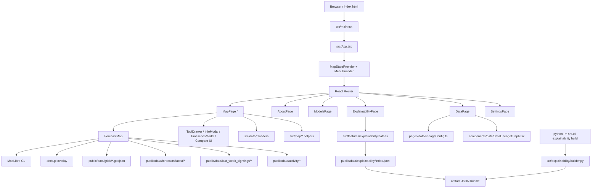

# Repo Current State
## 1. Executive Summary (10 bullets max)
- Repository is on branch `main` and appears clean: `git status --short --branch` returned only `## main...origin/main`.
- Primary runtime is a static client-side SPA built with React 18, TypeScript, Vite (`rolldown-vite`), React Router, MapLibre GL, and deck.gl.
- There is no backend server entrypoint for production traffic; app data is served from static files under `public/data` and the built output under `dist/`.
- A small Python utility surface exists under `src/cli` and `src/explainability`, primarily for building explainability artifacts consumed by the frontend.
- The main interactive architecture is `src/main.tsx` -> `src/App.tsx` -> `src/pages/MapPage.tsx` -> `src/components/ForecastMap.tsx`, with shared UI state in `src/state`.
- The repository is data-heavy: `public/` contains 992 files, including 180 weekly forecast JSONs, 180 actuals JSONs, 360 SHAP JSONs, 177 blurred contour GeoJSONs, and 61 last-week sightings overlays.
- Explainability is static-file driven as well: `public/data/explainability/index.json` points to one artifact context, and the React page fetches artifact JSON files directly.
- Testing/tooling is light: ESLint is configured, TypeScript build is configured, only two `.test.ts` files exist, and no test runner script or CI workflow is present.
- Generated/vendor artifacts are tracked in git: `node_modules/` has 20,462 tracked files, `dist/` has 1,007 tracked files, and `.DS_Store` / `__pycache__` artifacts are also committed.
- Several operational assumptions are hard-coded, including the forecast period in `src/config/appConfig.ts` (`2026-02-16` through `2026-02-22`) and frontend path conventions in `src/config/dataPaths.ts`.

## 2. How To Run (Dev / Test / Build / Deploy)
### Dev
- Install dependencies: `npm install`
- Start local dev server: `npm run dev`
- Vite default port is used; no custom port is configured in `vite.config.ts`.

### Test
- There is no wired test command in `package.json`.
- Practical validation currently appears to be:
  - `npm run lint`
  - Manual route and data checks documented in `README.md`
- Two TypeScript test files exist:
  - `src/features/explainability/utils.test.ts`
  - `src/map/deltaMap.test.ts`
- No Vitest/Jest/Playwright/Cypress config was found.

### Build
- Production build: `npm run build`
- Preview built app locally: `npm run preview`
- Build output directory is `dist/`.

### Deploy
- README describes Cloudflare Pages deployment.
- Best current deploy inference:
  - Build command: `npm run build`
  - Publish directory: `dist`
  - SPA fallback must route deep links to `index.html`
- No checked-in Cloudflare config, Dockerfile, Compose file, Procfile, Makefile, or CI workflow was found.

### Python Utility / Preprocessing
- Explainability artifact builder CLI:
  - `python3 -m src.cli explainability build --run-id ... --model-id ... --target ... --sample-n 50000 --top-k-interactions 50`
- `package.json` also references `tiles:*` Python scripts under `scripts/tiles/`, but the `scripts/` directory is not present in the repository.

## 3. Top-Level Structure (table: path | purpose | key files | notes)
| path | purpose | key files | notes |
| --- | --- | --- | --- |
| `/` | Repo root and build/config entry surface | `package.json`, `vite.config.ts`, `eslint.config.js`, `tsconfig*.json`, `index.html`, `README.md` | Root files define the frontend toolchain, build, linting, and deployment guidance. |
| `docs/` | Human-written project docs and screenshots | `docs/explainability.md`, `docs/map-data-audit.md`, `docs/vector-tiles.md`, `docs/screenshots/*` | Mostly reporting/documentation; screenshot assets are relatively large. |
| `public/` | Static runtime assets shipped with the SPA | `public/data/*`, `public/images/*` | This is the effective data backend for the app. Includes dense JSON/GEOJSON inventories and some committed `.DS_Store` files. |
| `src/` | Frontend app source plus Python helper modules | `src/main.tsx`, `src/App.tsx`, `src/pages/MapPage.tsx`, `src/components/ForecastMap.tsx`, `src/state/*`, `src/cli/__main__.py` | Main app logic is concentrated here. Contains both TS/React code and Python preprocessing utilities. |
| `dist/` | Built frontend output | `dist/assets/*`, `dist/data/*` | Generated artifact directory is committed to git and mirrors the static runtime shape. Excluded from the structure tree below, but important operationally. |
| `node_modules/` | Installed frontend dependencies | package trees under many vendors | Vendor directory is committed to git, which is unusual for this project type and materially affects repo size. |

### Filtered tree (depth 4, excluding generated/vendor dirs)
```text
PERFORMANCE_REVIEW.md
README.md
docs/
  explainability.md
  map-data-audit.md
  screenshots/
    .gitkeep
    OrcaCast_About.png
    OrcaCast_Data.png
    OrcaCast_Explainability.png
    OrcaCast_Map.png
    OrcaCast_Models.png
    README.md
  vector-tiles.md
eslint.config.js
index.html
package-lock.json
package.json
public/
  .DS_Store
  data/
    activity/
      activity_by_decade_week_SRKW_H4.json
      activity_by_decade_week_SRKW_H5.json
      activity_by_decade_week_SRKW_H6.json
    expected_count/
      H4_ACTUAL_ACTIVITY.json
      H4_EXPECTED_ACTIVITY.json
      H5_ACTUAL_ACTIVITY.json
      H5_EXPECTED_ACTIVITY.json
      H6_ACTUAL_ACTIVITY.json
      H6_EXPECTED_ACTIVITY.json
    explainability/
      SRKW_r4_W_19700101_20241231_v_1_0_2/
      index.json
    forecasts/
      latest/
    grids/
      H4.geojson
      H5.geojson
      H6.geojson
    last_week_sightings/
      all_last_week_sightings.geojson
      last_week_sightings_2025-W1.geojson
      ...
    periods.json
    places_of_interest.json
  images/
    OrcaHex_Logo.png
    OrcaTimeSeries_Icon.png
    OrcaTimeSeries_Icon_Arch.png
    about/
      StephenWalker_Image.jpg
src/
  App.css
  App.tsx
  __init__.py
  assets/
    react.svg
  cli/
    __init__.py
    __main__.py
  components/
    AppFooter.tsx
    AppHeader.tsx
    AttributionHover.tsx
    Compare/
      CompareAdvancedPopover.tsx
      CompareDividerPill.tsx
      CompareTray.tsx
      DualMapCompare.tsx
      SingleSwipeMap.tsx
      SplitCompareView.tsx
      SwipeComparePills.tsx
      SwipeCompareView.tsx
    ForecastMap.tsx
    ToolDrawer.tsx
    data/
      DataLineageGraph.tsx
      SourceDetailsPanel.tsx
    explainability/
      ComparePanel.tsx
      DriversPanel.tsx
      ExplainabilityHeader.tsx
      InteractionsPanel.tsx
      MovementPanel.tsx
      WindowPanel.tsx
      plots.tsx
    modals/
      TimeseriesModal.tsx
    ui/
      OrcaDropdown.tsx
  config/
    appConfig.ts
    attribution.ts
    dataPaths.ts
    mapLayers.ts
  constants/
    palettes.ts
  core/
    time/
      forecastPeriodToIsoWeek.ts
  data/
    expectedCount.ts
    forecastIO.ts
    kdeBandsIO.ts
    periods.ts
  explainability/
    __init__.py
    builder.py
  features/
    explainability/
      data.ts
      types.ts
      utils.test.ts
      utils.ts
    models/
      components/
      data/
      models.css
  main.tsx
  map/
    colorScale.ts
    deltaMap.test.ts
    deltaMap.ts
    gridOverlay.ts
    sourceBackend.ts
  mock/
  pages/
    AboutPage.tsx
    DataPage.tsx
    ExplainabilityPage.tsx
    MapPage.tsx
    ModelsPage.tsx
    PerformancePage.tsx
    SettingsPage.tsx
    data/
      coverageMatrix.ts
      lineageConfig.ts
  state/
    MapStateContext.tsx
    MenuContext.tsx
    compareStore.ts
  styles.css
  tour/
    startMapTour.ts
  types/
    dagre.d.ts
  visualization/
    __init__.py
    geo_prune.py
tsconfig.app.json
tsconfig.json
tsconfig.node.json
vite.config.ts
```

## 4. Architecture Map (mermaid diagram + short explanation)


Short explanation:
- Runtime is frontend-only. The browser loads the SPA and the SPA fetches JSON/GEOJSON assets directly from `public/data`.
- `MapPage` is the main orchestration layer for period/model selection, compare modes, overlays, and modal workflows.
- `ForecastMap` owns map rendering and source/layer management, delegating lower-level behavior to `src/map/*` helpers.
- Explainability artifacts are prebuilt offline by Python utilities, then served as static JSON and consumed by the React explainability page.

## 5. Key Entry Points (backend, frontend, scripts, workers)
### Frontend
- `index.html`
  - Browser shell, Google Fonts includes, and root div.
- `src/main.tsx`
  - React bootstrap entrypoint.
- `src/App.tsx`
  - Global providers and route registration.
- `src/pages/MapPage.tsx`
  - Main application controller for forecasts, compare state, overlays, screenshots, and modals.
- `src/components/ForecastMap.tsx`
  - Map renderer and integration point for MapLibre, deck.gl, hover behavior, layer sources, and snapshot capture.

### Page-level entrypoints
- `/` -> `src/pages/MapPage.tsx`
- `/about` -> `src/pages/AboutPage.tsx`
- `/models` -> `src/pages/ModelsPage.tsx`
- `/explainability` -> `src/pages/ExplainabilityPage.tsx`
- `/data` -> `src/pages/DataPage.tsx`
- `/settings` -> `src/pages/SettingsPage.tsx`
- `src/pages/PerformancePage.tsx` exists but the route is commented out in `src/App.tsx`.

### Scripts / Utility entrypoints
- `package.json`
  - `dev`, `build`, `lint`, `preview`
  - `tiles:check`, `tiles:build:last-week` reference missing Python scripts under `scripts/tiles/`
- `src/cli/__main__.py`
  - Python CLI entrypoint for explainability build operations.
- `src/explainability/builder.py`
  - Python artifact builder that reads SHAP-style JSON inputs and writes explainability bundles.

### Workers / Services
- No backend service entrypoint found.
- No queue worker, cron worker, or job runner config found.
- No Docker, Compose, Kubernetes, or Procfile orchestration found.

## 6. Data Flow (inputs -> processing -> storage -> outputs)
### Forecast map flow
1. Static index and bundle load in browser.
2. `MapPage` loads available periods from `public/data/periods.json`.
3. For the selected period and resolution, `src/data/forecastIO.ts` loads:
   - grid GeoJSON from `public/data/grids/*.geojson`
   - forecast JSON from `public/data/forecasts/latest/weekly/*`
   - actuals JSON from `public/data/forecasts/latest/actuals/*`
4. `attachProbabilities()` joins forecast values to grid features by H3 cell id.
5. `ForecastMap` and `src/map/*` convert that combined data into MapLibre/deck.gl layers.
6. Optional overlays load additional static files:
   - blurred contours from `weekly_blurred/`
   - last-week sightings from `last_week_sightings/`
   - expected/actual activity and POI data from other `public/data/*` files
7. Output is a fully client-rendered interactive map, plus optional snapshot export.

### Explainability flow
1. Python builder scans SHAP JSON files under `public/data/forecasts/latest/shap/`.
2. Builder produces artifact bundles under `public/data/explainability/<run>/<model>/<target>/`.
3. `src/features/explainability/data.ts` fetches `public/data/explainability/index.json`.
4. `ExplainabilityPage` loads `meta.json`, `features.json`, `shap_samples.json`, `global_importance.json`, and optional interaction files.
5. Output is a static-data-driven explainability UI with drivers, window comparisons, movements, and interactions panels.

### Documentation / lineage flow
1. `DataPage` loads in-memory configuration from `src/pages/data/lineageConfig.ts` and `coverageMatrix.ts`.
2. `DataLineageGraph.tsx` renders a ReactFlow-based lineage visualization.
3. Output is a static interpretability and provenance page; it does not appear to fetch live backend data.

## 7. Configuration & Secrets Handling
### Configuration patterns
- Frontend runtime config is code-based, not environment-based:
  - `src/config/appConfig.ts`
  - `src/config/dataPaths.ts`
  - `src/config/mapLayers.ts`
  - `src/config/attribution.ts`
- `import.meta.env.BASE_URL` is used for asset path prefixing.
- No `.env`, `.env.example`, settings module, or JSON/YAML config hierarchy was found.

### Hard-coded paths / dates / URLs
- Hard-coded forecast period in `src/config/appConfig.ts`:
  - start: `2026-02-16`
  - end: `2026-02-22`
- Hard-coded data folder conventions in `src/config/dataPaths.ts`, for example:
  - `data/grids/H4.geojson`
  - `data/forecasts/latest/weekly/...`
  - `data/forecasts/latest/actuals/...`
  - `data/forecasts/latest/shap/...`
- Explainability index currently points to a single context:
  - `SRKW_r4_W_19700101_20241231_v_1_0_2`
- External URLs observed:
  - Google Fonts stylesheet URLs in `index.html`
  - Cloudflare Pages URL in `README.md`
- No hard-coded localhost ports or backend base URLs were found.

### Caching behavior
- `src/config/dataPaths.ts` appends a cache-busting query string based on `Date.now()` for forecast/actual/shap URLs.
- Result: each page load generates new asset URLs, which weakens browser/CDN caching and complicates reproducibility debugging.

### Secrets handling
- No obvious secrets or private key material were detected by a lightweight repository scan.
- No dedicated secret-management mechanism is present in the repo.
- Secret exposure risk is low in current checked files, but the absence of a formal `.env.example` or config contract means future secret handling would likely be ad hoc unless standardized.

## 8. Testing, Tooling, CI/CD
### Tooling present
- Package manager / frontend build:
  - `npm`
  - Vite via `rolldown-vite`
  - TypeScript project references
- Linting:
  - ESLint 9 flat config in `eslint.config.js`
- Styling:
  - CSS files only; no Tailwind/PostCSS app config was found

### Testing present
- Two isolated test files:
  - `src/features/explainability/utils.test.ts`
  - `src/map/deltaMap.test.ts`
- No discovered test runner configuration:
  - no `vitest.config.*`
  - no `jest.config.*`
  - no Playwright/Cypress config
- No `test` script in `package.json`

### CI/CD present
- No `.github/workflows/*` found.
- No pre-commit config found.
- No containerized deployment config found.
- Deployment process appears documentation-driven rather than config-driven.

### Coverage signals
- README includes a manual validation checklist.
- There is no automated coverage report, `coverage/` directory, or badge.

## 9. Findings (group by: critical / important / nice-to-have)
### Critical
- Generated/vendor artifacts are committed:
  - `node_modules/` has 20,462 tracked files
  - `dist/` has 1,007 tracked files
  - This materially increases repo weight, slows git operations, and mixes source with install/build output.
- `package.json` references missing preprocessing scripts:
  - `tiles:check` -> `scripts/tiles/check_large_assets.py`
  - `tiles:build:last-week` -> `scripts/tiles/build_vector_tiles.py`
  - The `scripts/` directory does not exist, so those commands are currently broken.

### Important
- Python helper code is present but no Python dependency manifest was found.
  - No `pyproject.toml`, `requirements.txt`, `tox.ini`, or `pytest.ini`
  - Reproducing the Python tooling environment is currently ambiguous.
- Operational freshness depends on code edits or manual data refresh.
  - `src/config/appConfig.ts` hard-codes the forecast period `2026-02-16` to `2026-02-22`.
- Browser caching is intentionally defeated for forecast-like assets.
  - `src/config/dataPaths.ts` uses `Date.now()` as a cache-bust token.
- Frontend control flow is concentrated in very large files.
  - `src/components/ForecastMap.tsx`: 2,275 lines
  - `src/pages/MapPage.tsx`: 1,288 lines
  - `src/styles.css`: 9,942 lines
  - `src/pages/data/lineageConfig.ts`: 729 lines
- Automated quality gates are weak.
  - No CI workflow
  - No test script
  - Only two test files
- Some committed artifacts are likely accidental:
  - `.DS_Store` files under `public/` and `public/data/`
  - `__pycache__` bytecode under `src/`
- Runtime/static data surface is large and tightly coupled to the UI.
  - `public/` has 992 files and functions as the de facto data backend.
- Explainability and models appear partially scaffolded/static rather than fully dynamic.
  - `public/data/explainability/index.json` contains one context only
  - `ModelsPage` renders `DUMMY_MODELS`

### Nice-to-have
- `src/pages/PerformancePage.tsx` exists but is not routed.
- `src/mock/` exists but is empty.
- README deployment guidance is present, but the actual deployment config is not checked in.
- Screenshot and artifact assets are relatively large; for example `docs/screenshots/OrcaCast_About.png` is about 5.8 MB.

## 10. Refactor Opportunities (NOT tasks yet; just opportunities)
- Separate source, install state, and build state. The repo would be easier to reason about if `node_modules/`, `dist/`, bytecode, and OS metadata were removed from versioned source control.
- Break `MapPage` into focused orchestration hooks or controllers for period/model selection, compare mode, modal state, and export/share flows.
- Break `ForecastMap` into modules for map bootstrapping, source resolution, layer registration, hover/selection logic, and snapshot/export behavior.
- Move static path/date assumptions into a clearly versioned runtime config contract instead of scattering them across TS modules.
- Introduce a formal data access layer for `public/data` that centralizes path construction, caching policy, and schema validation.
- Modularize the CSS surface, especially `src/styles.css`, so page-level styling and map-specific styling can evolve independently.
- Formalize the Python tooling as a separate, reproducible package or tooling directory with declared dependencies and documented inputs/outputs.
- Distinguish production data artifacts from source-owned UI assets; static forecast/SHAP/GeoJSON payloads are large enough to justify a deliberate packaging strategy.
- Replace placeholder/scaffolded areas with explicit feature boundaries: routed-but-static pages, dummy models, and the unused performance page currently blur what is production versus exploratory.
- Add machine-verifiable quality boundaries around the current architecture: test runner, smoke tests for route/data loading, and deploy-time validation of required static files.
